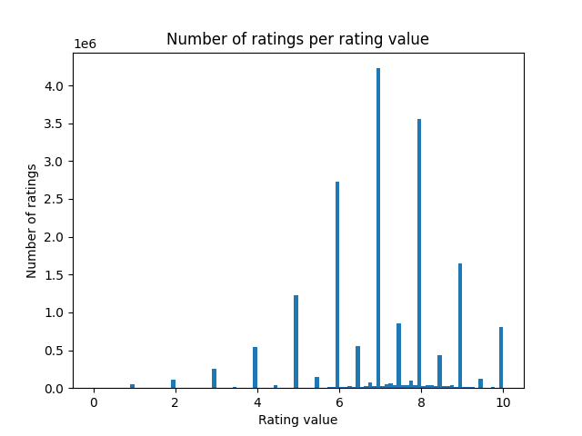
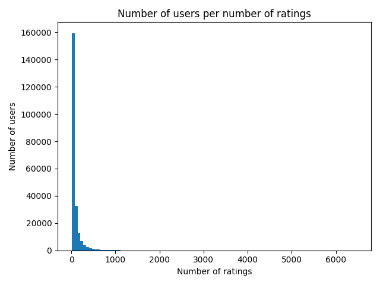
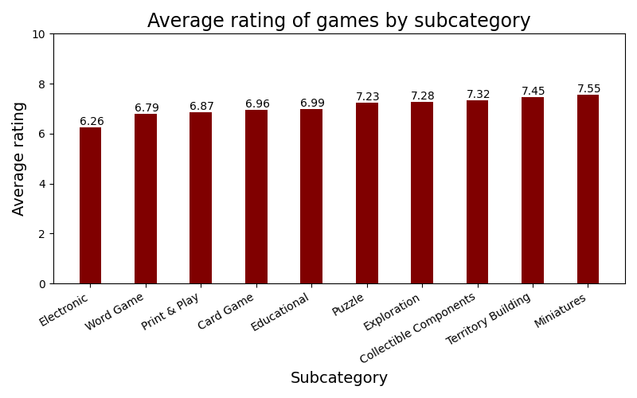
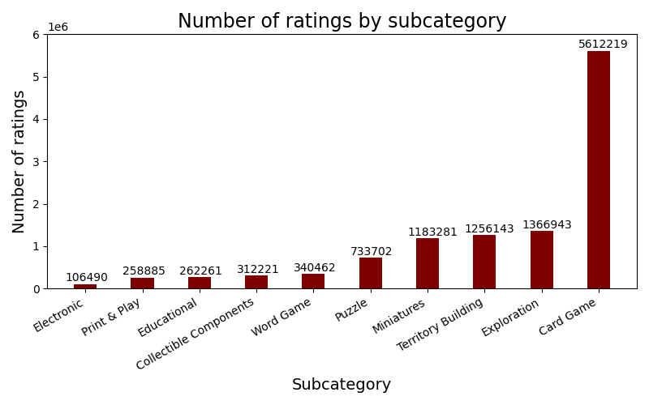

# 🎲 Board games recommender system

See the app deployed [here](https://pv254-board-games-recommender.vercel.app/).

## Team

- Matěj Bukáček
- Petr Janík
- Jakub Kraus
- Michal Salášek

## Consultation 1 - April 4th 10:00

- problem formulation, clarification of the purpose, for whom, why
	- recommendation board games to users who like to play board games and want to try new ones
- usage
	- website visitor rates 10 games and gets paged recommendations sorted from the most relevant
	- on each page there will be 5 recommendations from each algorithm randomly interleaved
	- for each recommendation there will be a button to reveal the algorithm used
- hypothetical business model
	- referral links / eshop
- specific data with some basic analysis (value distributions etc.)
	- [dataset](https://www.kaggle.com/datasets/threnjen/board-games-database-from-boardgamegeek?select=user_ratings.csv):
		- relevant columns:
			- games
				- ImagePath - Image http:// path
			- user_ratings
				- BGGId - BoardGameGeek game ID
				- Rating - Raw rating given by user
				- Username - User giving rating
	- data preprocessing:
		- there were multiple ratings of the same game by some users - duplicates removed, only the latest rating kept (ratings don't have timestamps, so we assumed file `user_ratings.csv` is ordered chronologically and kept only the last occurence of `Username - BGGId` pair in the file) -> 32 687 ratings removed (0.17%)
		- removed users with less than 10 ratings
		- removed games with less than 10 ratings
	- analysis (after data preprocessing):
		- 18 340 284 user ratings
		- 224 557 users
		- 21 919 games, 217 themes, 10 subcategories (only 10 030 games (45.76%) belong to some subcategory)
		- density of user ratings matrix: 0.37%
		- average number of ratings per user: 81.67
		- median number of ratings per user: 39
		- maximum number of ratings per user: 6478
		- average rating: 7.10 (range [0, 10])
		- 
		- 
		- 
		- 

- specific proposal for algorithms that you want to implement
	- memory based CF (Pearson correlation coefficient, item-based for easier interpretation of results) - Jakub Kraus
	- model based CF (gradient descent) - Michal Salášek
	- content based (TF-IDF) - Matěj Bukáček
	- possibly another content based
- implementation of some naive baseline
	- for CF (prediction is one number):
		- global average rating
	- for content based (prediction is a list of games):
		- top-rated games (by available `Rank:boardgame` property)
		- most rated games
		- random games
- basic idea of evaluation approach
	- because we are doing a prototype project, we will focus more on the manual evaluation and less on the technical evaluation
	- technical (only for CF):
		- data will be split into 80% and 20%
			- at the very end, once we choose the best model, we will use the 20% of data for final evaluation
			- 80% will be used for training
				- it will be split into 80% and 20% using 5-fold cross-validation
					- for models that require validation set (to stop the training) this 80 % will be split again into 80% and 20%
		- used metric will be RMSE
	- by real users’ happiness:
		- we will give our system to real users and collect their feedback
	- by archetype users:
		- we will create several archetypes of users and evaluate our system on them (by seeing if the recommendations
		  are what we would expect)

## Consultation 2 - April 25th 10:00

- functional demo of several recommendation algorithms (at least some basic version)
- preliminary subjective evaluation (does it seem to do something meaningful?)
- specific examples of "interesting" recommendations (both good and poor)
- detailed plan for evaluation
- specific problems encountered, questions
