

# Board games recommender

Matěj Bukáček, Petr Janík, Jakub Kraus, Michal Salášek, 2023

---

[//]: # (Part 1)
# Discussion of the topic, specific aspects of recommendations in the particular domain

---

# Description of the used data, some basic descriptive statistics of the data

---
[//]: # (Part 2)
# TF-IDF
- most of relevant data are binary flags + some numerical values and Description
- pipeline:
  - convert binary flags and numerical values to text
  - concatenate with description
  - compute TF-IDF matrix
  - compute cosine similarities
  - choose rows with rated games
  - sort games based on similarity score
---
- Problems:
  - during development:
    - converting everything to text (so that i could use library function)
    - mapping index in matrix to index in database
  - finished product:
    - reimplementations

- Evaluation:
  - no exact metric, just by feedback
  - mostly positive feedback, but problems when game has too many reimplementations (those are very similar, so they get high score)
---

# Latent factors
- Description of the used recommender techniques, relation to standard techniques discussed during lectures (focus on the description of the overall pipeline, not on details of individual steps, particularly when using standard techniques like TF-IDF or cosine similarity)
- Specific examples of recommendations, e.g., in the form of screenshots of the developed application
- Results of the evaluation
- Experience report (problems, mistakes, useful tools, ...)
---
# Memory based CF
- Pipeline:
  - Ratings matrix (users x games) - get users that rated same games as me
  - Unrated game - keep users who rated it
  - Find k most similar users to me
  - Get mean rating
---
- Qualitative evaluation
  - Only on local device (not deployed with the app)
  - Low amount of feedback - testing in Postman
  - Not very intuitive, much novelty and unexpected recommendations
  - Stick to category - RPGs recommend RPGs
---

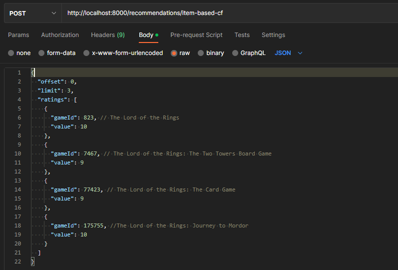

---

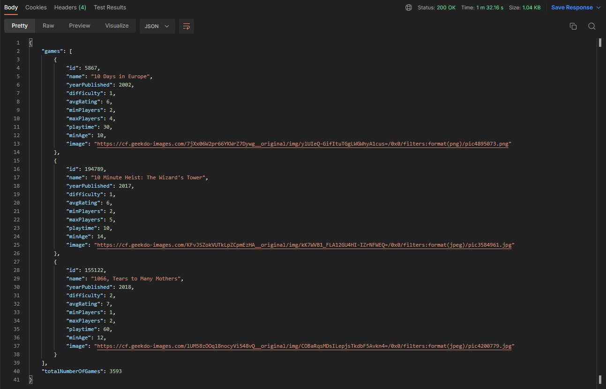

---

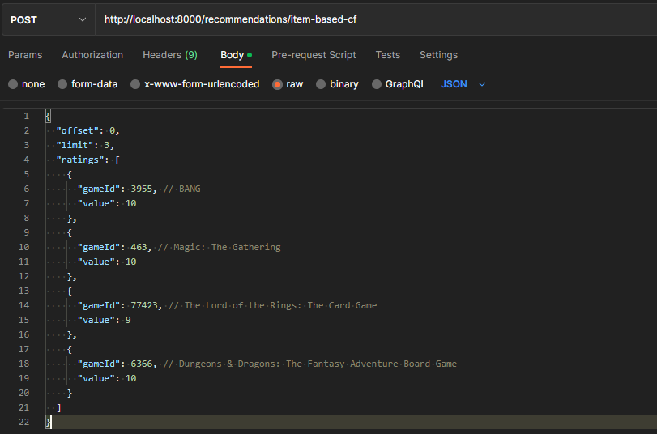

---

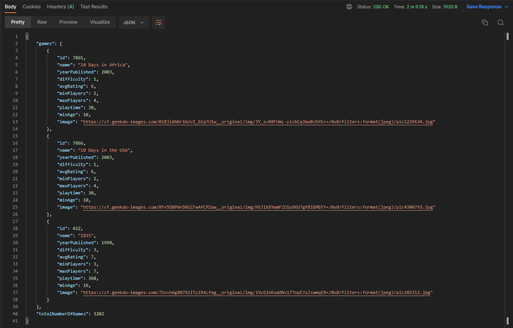

---
- Encountered problems:
  - performance - not usable in real-time, not deployed
  - implementation - several new technologies (also programming on Windows)
  - memory - creation of ratings matrix on local device
---

[//]: # (Part 3)
# User interface

---

---

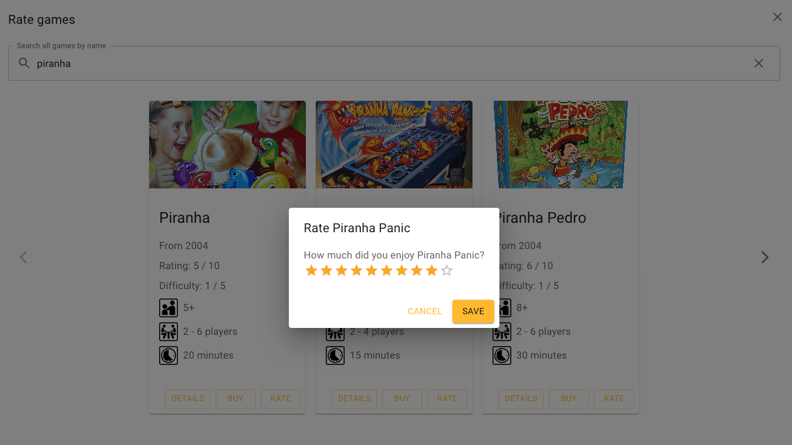

---

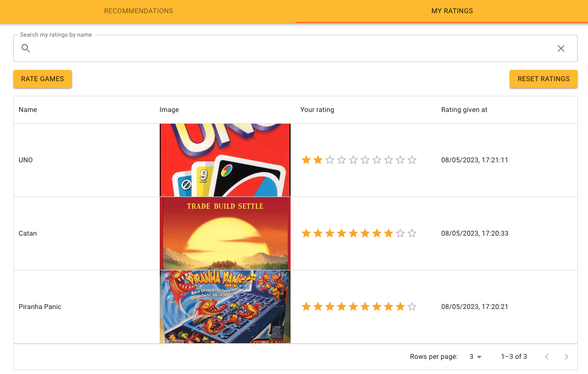

---

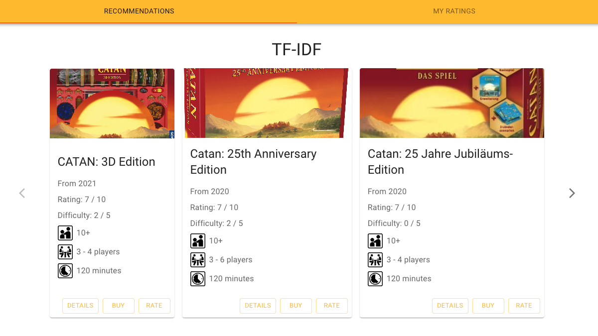

---

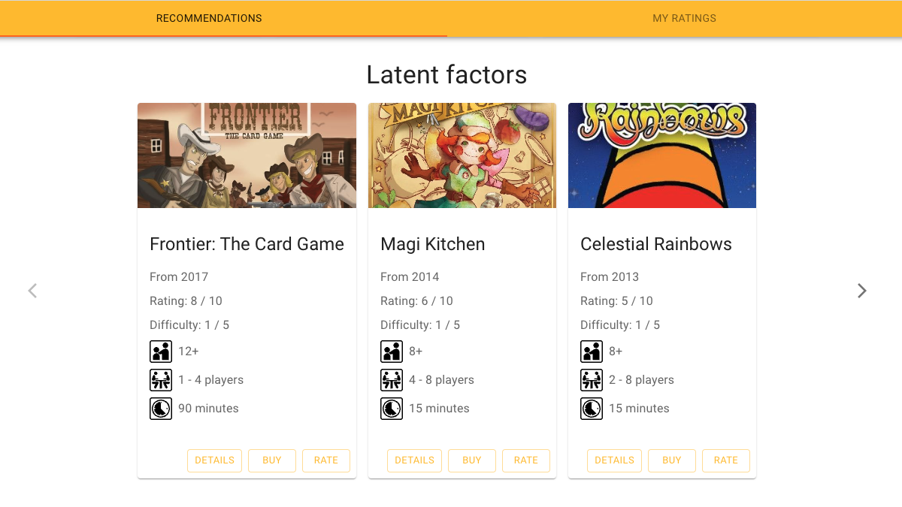

---

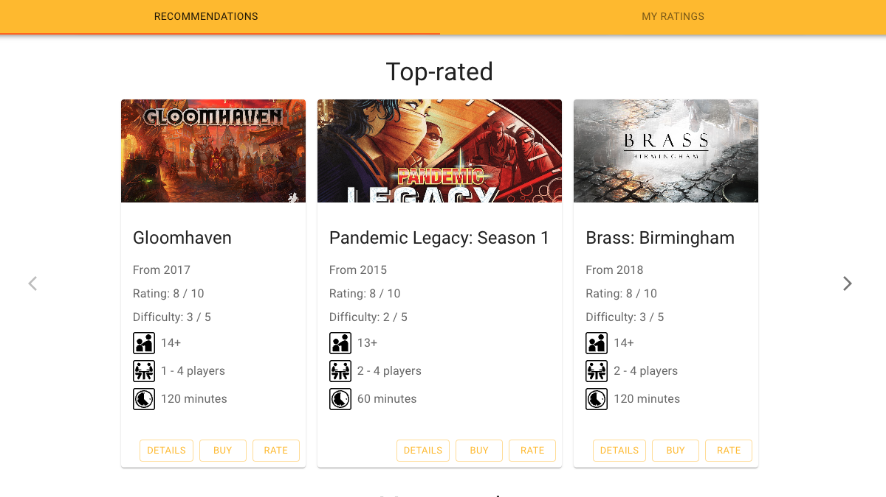

---

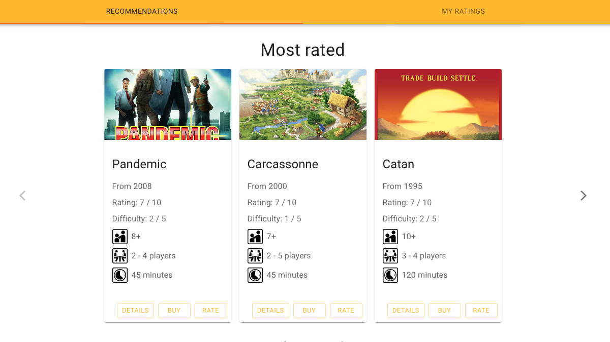

---

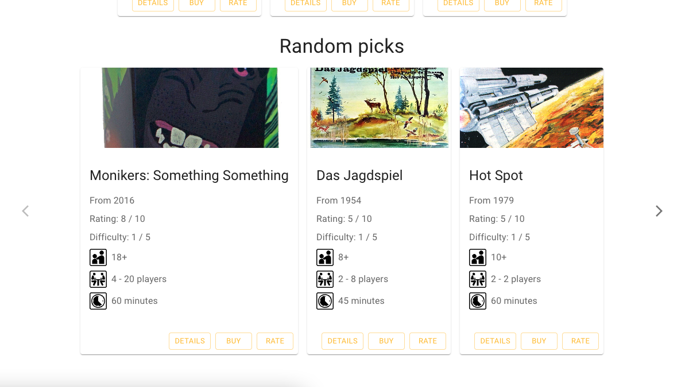

---

# Thank you

Try it out: https://pv254-board-games-recommender.vercel.app/
Code: https://github.com/petr7555/pv254-board-games-recommender
