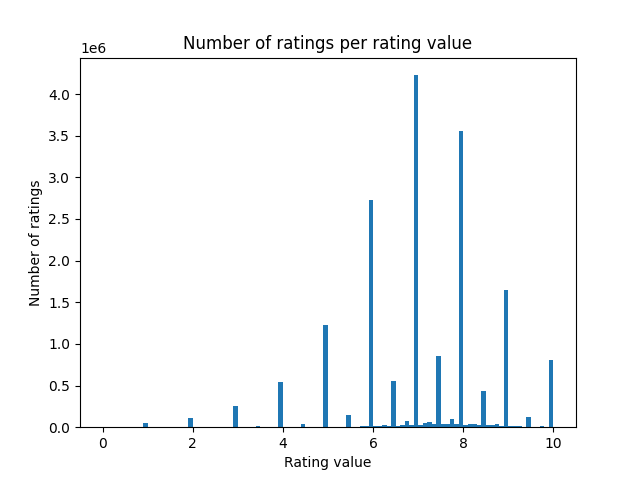
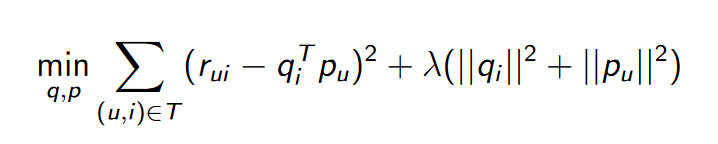

# Board games recommender

Matěj Bukáček, Petr Janík, Jakub Kraus, Michal Salášek, 2023

---

[//]: # (Part 1)

# Goal & Motivation

- Develop a recommender system for board games
	- users who like to play board games and want to try new ones
- Possible monetization:
	- e-shop
	- referral links to e-shops

---

# Data

- from [kaggle](https://www.kaggle.com/datasets/threnjen/board-games-database-from-boardgamegeek)
- `games`, `mechanics`, `subcategories`, `themes`
- `user_ratings`
	- `BGGId` - BoardGameGeek game ID
	- `Rating` - Raw rating given by user
	- `Username` - User giving rating

---

## Data preprocessing

- removed duplicate ratings
- removed users with less than 10 ratings
- removed games with less than 10 ratings

---

## Data analysis

- **18 340 284** user ratings
- **224 557** users, **21 919** games, **157** mechanics, **217**&nbsp;themes, **10** subcategories
- density of user ratings matrix: **0.37%**
- ratings per user:
	- average: **81.67**
	- median: **39**
	- maximum: **6478**
- average rating: **7.10** (range **[0, 10]**)

---

---

---

---

---

[//]: # (Part 2)

# TF-IDF

- most of relevant data are binary flags + some numerical values and Description
- pipeline:
	- convert binary flags and numerical values to text
	- concatenate with description
	- compute TF-IDF matrix
	- compute cosine similarities
	- choose rows with rated games
	- sort games based on similarity score

---

## Problems

- during development:
	- converting everything to text (so that library function could be used)
	- mapping index in matrix to index in database
- finished product:
	- reimplementations

---

## Evaluation

- no exact metric, just by feedback
- mostly positive feedback, but problems when game has too many reimplementations
  (those are very similar, so they get high score)
- examples of recommendations at the end

---

# Latent factors

- **idea**:
	- we are trying to model "taste" of users and "features" of items
	- matrices of user / item latent factors
- **approach**: minimize squared errors (+ regularization)
- **method**: stochastic / mini-batch gradient descent

---

---

---

## Pipeline I

- split dataset into **train**, **validation** and **test** set
	- **idea**: all games should be present in all three datasets

---

---

---

## Pipeline II

- use training set (user ratings) to **train** the model
	- adjust matrices of user / item factors using **gradient descent**
- use validation set to prevent overfitting
	- compute **RMSE**
	- apply early stopping if necessary
- use test set to **evaluate** the trained model (RMSE)

---

## Initial results I

- **stochastic** gradient descent too **slow**
	- necessary to reduce data
- adopt **mini-batch** gradient descent
	- allows to train on full data with more epochs / hyper-parameter tuning

---

## Initial results II

- predictions not quite "reasonable" (no obvious pattern)
	- 2 latent factors → 2D plane (similar to PCA) → **find features** in similar / "opposite" clusters
	- compare RMSE of latent factors model with **baselines**

---

---

## RMSE comparison

- global mean: 1.530
- user mean: 1.376
- item mean: 1.316
- global mean + item/user bias: 1.230
- latent factors: 1.19
- latent factors with global effects: 1.19

---

## New user

- approximate **user factors** from ratings
- item factors matrix is constant
- least squares
- simple approach (systems of equations)
- examples of recommendations at the end

---

## Experience report

- necessary to implement gradient descent myself
- necessary to make mini-batch
- additional effort to confirm algorithms are implemented correctly
- computing recommendations for new user initially unclear

---

# Memory based CF

- **pipeline:**
	- ratings matrix (users × games) - get users that rated the same games as me
	- unrated game - keep users who rated it
	- find k most similar users to me
	- get mean rating

---

## Qualitative evaluation

- only on local device (not integrated into the app)
- low amount of feedback - testing in Postman
- not very intuitive, much novelty and unexpected recommendations
- stick to category - RPGs recommend RPGs

---

---

---

---

---

## Encountered problems

- performance - not usable in real-time, not deployed
- implementation - several new technologies (also programming on Windows)
- memory - creation of ratings matrix on local device

---

[//]: # (Part 3)

# User interface

---

---

---

---

---

---

---

---

---

# Thank you

Try it out: https://pv254-board-games-recommender.vercel.app/
Code: https://github.com/petr7555/pv254-board-games-recommender
