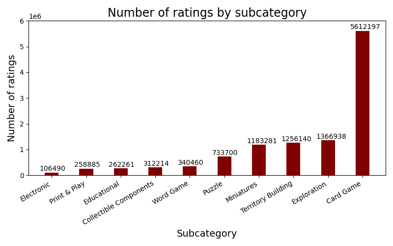

# Board games recommender

Matěj Bukáček, Petr Janík, Jakub Kraus, Michal Salášek, 2023

---

[//]: # (Part 1)

# Goal & Motivation

- Develop a recommender system for board games
	- users who like to play board games and want to try new ones
- Possible monetization:
	- e-shop
	- referral links to e-shops

---

# Data

- from [kaggle](https://www.kaggle.com/datasets/threnjen/board-games-database-from-boardgamegeek)
- `games`, `mechanics`, `subcategories`, `themes`
- `user_ratings`
	- `BGGId` - BoardGameGeek game ID
	- `Rating` - Raw rating given by user
	- `Username` - User giving rating

[//]: # (description of the used data, some basic descriptive statistics of the data)

---

# Data preprocessing

- removed duplicate ratings
- removed users with less than 10 ratings
- removed games with less than 10 ratings

---

# Data analysis

- **18 340 284** user ratings
- **224 557** users, **21 919** games, **157** mechanics, **217**&nbsp;themes, **10** subcategories
- density of user ratings matrix: **0.37%**
- ratings per user:
	- average: **81.67**
	- median: **39**
	- maximum: **6478**
- average rating: **7.10** (range **[0, 10]**)

---

---

---

---

---

[//]: # (Part 2)

# TF-IDF

- Description of the used recommender techniques, relation to standard techniques discussed during lectures (focus on
  the description of the overall pipeline, not on details of individual steps, particularly when using standard
  techniques like TF-IDF or cosine similarity)
- Specific examples of recommendations, e.g., in the form of screenshots of the developed application
- Results of the evaluation
- Experience report (problems, mistakes, useful tools, ...)

---

# Latent factors

- Description of the used recommender techniques, relation to standard techniques discussed during lectures (focus on
  the description of the overall pipeline, not on details of individual steps, particularly when using standard
  techniques like TF-IDF or cosine similarity)
- Specific examples of recommendations, e.g., in the form of screenshots of the developed application
- Results of the evaluation
- Experience report (problems, mistakes, useful tools, ...)

---

# Memory based CF

- Description of the used recommender techniques, relation to standard techniques discussed during lectures (focus on
  the description of the overall pipeline, not on details of individual steps, particularly when using standard
  techniques like TF-IDF or cosine similarity)
- Specific examples of recommendations, e.g., in the form of screenshots of the developed application
- Results of the evaluation
- Experience report (problems, mistakes, useful tools, ...)

---

[//]: # (Part 3)

# User interface

---

---

---

---

---

---

---

---

---

# Thank you

Try it out: https://pv254-board-games-recommender.vercel.app/
Code: https://github.com/petr7555/pv254-board-games-recommender
