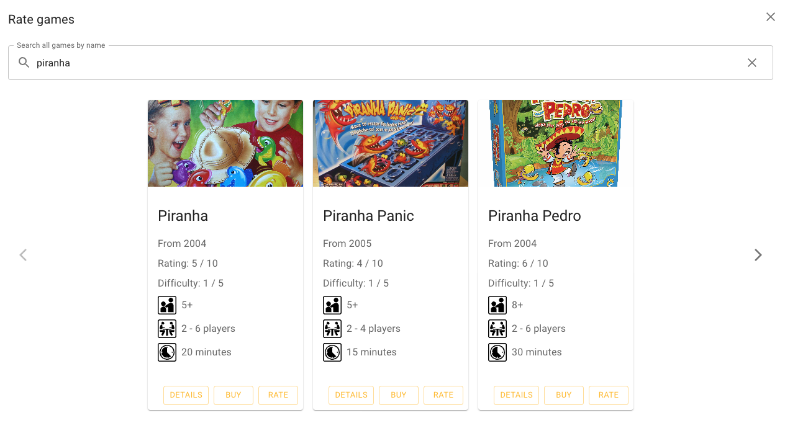

# Board games recommender

Matěj Bukáček, Petr Janík, Jakub Kraus, Michal Salášek, 2023

---

[//]: # (Part 1)
# Discussion of the topic, specific aspects of recommendations in the particular domain

---

# Description of the used data, some basic descriptive statistics of the data

---
[//]: # (Part 2)
# TF-IDF
- Description of the used recommender techniques, relation to standard techniques discussed during lectures (focus on the description of the overall pipeline, not on details of individual steps, particularly when using standard techniques like TF-IDF or cosine similarity)
- Specific examples of recommendations, e.g., in the form of screenshots of the developed application
- Results of the evaluation
- Experience report (problems, mistakes, useful tools, ...)

---

# Latent factors
- Description of the used recommender techniques, relation to standard techniques discussed during lectures (focus on the description of the overall pipeline, not on details of individual steps, particularly when using standard techniques like TF-IDF or cosine similarity)
- Specific examples of recommendations, e.g., in the form of screenshots of the developed application
- Results of the evaluation
- Experience report (problems, mistakes, useful tools, ...)
---

# Memory based CF
- Description of the used recommender techniques, relation to standard techniques discussed during lectures (focus on the description of the overall pipeline, not on details of individual steps, particularly when using standard techniques like TF-IDF or cosine similarity)
- Specific examples of recommendations, e.g., in the form of screenshots of the developed application
- Results of the evaluation
- Experience report (problems, mistakes, useful tools, ...)
---

[//]: # (Part 3)
# User interface

---

---

---

---

---

---

---

---

---

# Thank you

Try it out: https://pv254-board-games-recommender.vercel.app/
Code: https://github.com/petr7555/pv254-board-games-recommender
